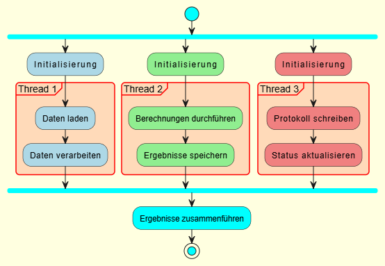

# C++-Beispielsammlung




## Beschreibung
Der `C++-Beispielsammlung` ist eine Sammlung von acht eigenständigen C++23-Projekten, die verschiedene Konzepte der modernen C++-Programmierung demonstrieren.  
Jedes Projekt enthält Quellcode, eine `README.md` mit Projektbeschreibung sowie eine MIT-Lizenz.  
Die Sammlung eignet sich sowohl für Lernzwecke als auch als Referenz für fortgeschrittene C++-Techniken.

### Projekte

| Projekt | Beschreibung |
|--------|--------------|
| [Binding](Binding/) | Bindung von Funktionsargumenten, Mitgliedsfunktionen und Datenmembern in einem Nachrichtenverarbeitungskontext. |
| [Invokable](Invokable/) | Verwendung von `std::invoke` für freie Funktionen, Lambdas, Mitgliedsfunktionen und Funktionsobjekte. |
| [Lambda](Lambda/) | Nutzung von Lambdas, Algorithmen (`std::for_each`, `std::partial_sum`, `std::all_of`, `std::none_of`) und Funktionsbindungen. |
| [LambdaThread](LambdaThread/) | Multithreading mit `std::jthread` und Lambda-Ausdrücken, inklusive synchronisierter Ausgabe. |
| [Multithreading](Multithreading/) | Verwaltung von Haupt-, System-, Status- und Abschlussmeldungen in parallelen Threads. |
| [SharedPtr](SharedPtr/) | Nutzung von `std::shared_ptr` in C++23 für geteilte Ressourcenverwaltung, Multithreading und polymorphe Objekte. |
| [ThreadDeadLock](ThreadDeadlock/) | Demonstration eines Deadlocks und wie man ihn vermeidet. |
| [ThreadRaceCondition](ThreadRaceCondition/) | Beispiel für eine Race Condition und deren Lösung mit `std::mutex`. |

## Anforderungen
- **Compiler**: GCC 15.1.0 oder höher (MSYS2 UCRT64, `C:\msys64\ucrt64\bin\g++.exe`)
- **CMake**: Version 3.27 oder höher
- **Ninja**: Build-System für CMake
- **VS Code**: Mit den Erweiterungen **C/C++** und **CMake Tools**
- **MSYS2 UCRT64**: Für Compiler und Build-Tools

## Einrichtung und Build

### 1. Repository klonen
```bash
git clone <repository-URL>
cd C++-Beispielsammlung
```

### 2. Abhängigkeiten installieren (in MSYS2 UCRT64 Konsole)

```bash
pacman -S mingw-w64-ucrt-x86_64-gcc mingw-w64-ucrt-x86_64-cmake \
          mingw-w64-ucrt-x86_64-ninja mingw-w64-ucrt-x86_64-gdb
```

### 3. VS Code konfigurieren (zentrales `.vscode/`)

Öffne den Hauptordner `C++-Beispielsammlung` in VS Code.

#### `.vscode/settings.json`

```json
{
    "C_Cpp.default.compilerPath": "C:\\msys64\\ucrt64\\bin\\g++.exe",
    "cmake.generator": "Ninja",
    "cmake.sourceDirectory": "${workspaceFolder}", // wird überschrieben
    "cmake.buildDirectory": "${workspaceFolder}/_dummy_", // verhindert globalen Build-Ordner
    "cmake.configureOnOpen": false
}
```
>💡 Hinweis: Die Datei .vscode/settings.json nutzt hier den absoluten Compiler-Pfad.
Sollte die Umgebungsvariable MSYS2_PATH für (z. B. C:\msys64\ucrt64\bin) in deiner Umgebung gesetzt sein, dann benutze:
>"C_Cpp.default.compilerPath": "${env:MSYS2_PATH}/g++.exe"
#### `.vscode/cmake-kits.json`

```json
[
    {
        "name": "GCC 15.1.0 UCRT64",
        "preferredGenerator": { "name": "Ninja" },
        "compilers": {
            "C": "C:\\msys64\\ucrt64\\bin\\gcc.exe",
            "CXX": "C:\\msys64\\ucrt64\\bin\\g++.exe"
        },
        "environmentVariables": {
            "PATH": "C:\\msys64\\ucrt64\\bin;${env:PATH}"
        }
    }
]
```

### 4. Build und Ausführung in VS Code

#### Variante A: über Task-Menü (empfohlen)

1. Öffne die Befehlspalette mit `Strg+Shift+P` und wähle `Tasks: Run Task`
2. Wähle z. B. `Build Binding`
3. Intern wird dabei ausgeführt:

   ```bash
   cmake -S Binding -B Binding/build && cmake --build Binding/build
   ```
4. Das erzeugte Binärdatei liegt danach z. B. unter `Binding/build/`

#### Variante B: manuell im Terminal

```bash
cmake -S Binding -B Binding/build
cmake --build Binding/build
Binding/build/Binding.exe
```

> ⚠️ Jeder Build erfolgt lokal im jeweiligen Projektordner – z. B. `Binding/build/`, `Lambda/build/`, usw.
> Das Hauptverzeichnis bleibt frei von Build-Artefakten.

#### Hinweis zur Shell für Build-Tasks

Die CMake-Build-Tasks in `.vscode/tasks.json` nutzen **Bash (MSYS2)** anstelle der Standard-PowerShell.
Dies ist notwendig, da PowerShell keine verketteten Shell-Befehle wie `&&` korrekt verarbeitet.

Damit der Build funktioniert, wird in `tasks.json` explizit Bash angegeben:

```json
"options": {
  "cwd": "${workspaceFolder}",
  "shell": {
    "executable": "C:\\msys64\\usr\\bin\\bash.exe",
    "args": ["-c"]
  }
}
```

**Vorteil**: Die globale Shell (z. B. für Python-Projekte) bleibt PowerShell – Bash wird nur lokal für die C++-Build-Tasks verwendet.

**Erforderlich**: Stelle sicher, dass `bash.exe` unter `C:\msys64\usr\bin\bash.exe` existiert (Standardpfad bei MSYS2).

#### Starten (Debug/Run)

* Ohne Debugging: `Strg+F5`
* Mit Debugging: `F5`
* Breakpoints, Variableninspektion und Konsolenausgabe funktionieren wie gewohnt.

## Lizenz

Dieses Projekt sowie alle enthaltenen Unterprojekte stehen unter der [MIT-Lizenz](LICENSE).
Details findest du in der zentralen Lizenzdatei.

## Beitrag

Beiträge sind willkommen!
Bitte eröffne ein Issue oder einen Pull Request auf GitHub.
